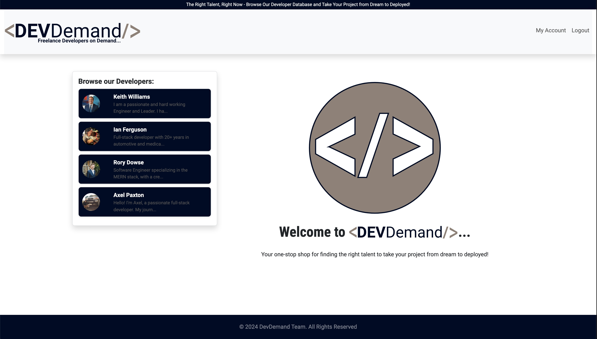

## <a name="top"></a>

# DevDemand

### Browse, Research, and Contact Freelance Web and Software Developers

---

[Visit the Deployed Application](https://devdemand.onrender.com)


## Description

DevDemand is a cutting-edge platform designed to connect freelance developers with individuals and small businesses in need of professional web and software development services. Whether you’re looking to build a website, enhance an application, or bring a bold new idea to life, DevDemand empowers you to find the right talent with ease.

At its core, DevDemand simplifies the process of discovering and hiring freelance developers. With our intuitive interface, you can browse through detailed developer profiles showcasing their skills, experience, and portfolios. Clients can make informed decisions by exploring each developer’s bio, hourly rates, Portfolios, GitHub projects, and more — all in one place.



#### Why Choose DevDemand?

- **Centralized Talent Hub**: A one-stop platform to browse developers with varied expertise, from front-end design to full-stack development.
- **Tailored Search Results**: Easily find developers that match your project requirements by reviewing their skills, location, and rates.
- **Direct Communication**: Streamlined contact options to connect directly with developers, enabling quicker project discussions and hiring decisions.
- **Empowering Developers**: DevDemand provides a platform for freelance developers to showcase their unique skillsets and grow their professional network.

#### Here’s what you can do on DevDemand:

- Discover developers with specialized skills, like React, TypeScript, Node.js, and more.
- View comprehensive profiles, including portfolios, GitHub links, and personal bios.
- Contact and collaborate with developers to bring your project from dream to deployed.

---

## Table of Contents

- [Features](#features)
- [Technologies Used](#technologies-used)
- [Installation](#installation)
- [GraphQL Queries and Mutations](#graphql-queries-and-mutations)
- [Usage](#usage)
- [Tests](#tests)
- [Contributors](#contributors)
- [Questions](#questions)
- [License](#license)

---

## Features

#### Developer Management:

- Developers can sign up, log in, and update their profiles.
- Clients can browse through developer profiles to find the perfect match for their projects.

#### GraphQL API:

- Efficiently fetch data and interact with developers’ information using powerful GraphQL queries and mutations.

#### Responsive Design:

- Optimized for both desktop and mobile viewing.

#### End-to-End Security:

- Uses JWT for secure authentication.

---

## Technologies Used

The **DevDemand** application leverages a comprehensive tech stack to deliver a seamless experience for developers and clients. Below are the key technologies, frameworks, libraries, and tools used in the project:

### Back-End Technologies:

#### Libraries and Frameworks

- [**Apollo Server**](https://www.apollographql.com/docs/apollo-server): A powerful GraphQL server for building APIs with schema definitions and resolvers.
- [**Express.js**](https://expressjs.com/): Simplifies server creation, routing, and middleware handling for Node.js applications.

#### Runtime Environment

- [**Node.js**](https://nodejs.org/en): A JavaScript runtime environment used for executing server-side code and building scalable network applications.

#### Database and ORM

- [**MongoDB**](https://www.mongodb.com/): A NoSQL database for storing and managing developer profiles and user data.
- [**Mongoose**](https://mongoosejs.com/): An Object Data Modeling (ODM) library that provides schema-based solutions for application data in MongoDB.

#### Authentication

- [**bcrypt**](https://www.npmjs.com/package/bcrypt): A library for hashing and securely storing user passwords.
- [**jsonwebtoken (JWT)**](https://www.npmjs.com/package/jsonwebtoken): A standard for securely transmitting information between server and client, primarily used for authentication.

#### Environment Management

- [**dotenv**](https://www.npmjs.com/package/dotenv): Manages environment variables securely in .env files.

### Front-End Technologies

#### Libraries and Frameworks

- [**React**](https://react.dev/): A JavaScript library for building dynamic, component-based user interfaces.
- [**react-router-dom**](https://reactrouter.com/en/main): Provides routing capabilities for seamless navigation between pages.
- [**react-bootstrap**](https://react-bootstrap.netlify.app/): A Bootstrap implementation for React components to streamline front-end design.
- [**Bootstrap**](https://getbootstrap.com/): A front-end framework for building responsive, mobile-first designs using its grid system and pre-styled components.

#### Rendering

- [**react-dom**](https://www.npmjs.com/package/react-dom): Integrates React with the DOM, enabling React components to render efficiently within the browser.

#### GraphQL and State Management

- [**Apollo Client**](https://www.apollographql.com/docs/react): Simplifies state management and API interaction for GraphQL queries and mutations.
- [**GraphQL**](https://graphql.org/): A flexible query language and runtime for APIs that lets clients request only the data they need.

#### Testing and Debugging

- [**Cypress**](https://www.cypress.io/): An end-to-end testing framework for ensuring application reliability.
- [**Vitest**](https://vitest.dev/): A fast unit testing framework tailored for Vite projects.
- [**msw (Mock Service Worker)**](https://mswjs.io/): A testing tool that intercepts network requests and provides mock responses for testing client-server interactions.
- [**JSDOM**](https://www.npmjs.com/package/jsdom): Simulates a web browser environment for testing browser-specific code without a real browser.

### Development Tools

#### Build Tools

- [**Vite**](https://vite.dev/): A modern build tool offering fast development and production-ready builds.
- [**TypeScript**](https://www.typescriptlang.org/): A superset of JavaScript that introduces static typing and interfaces for improved code reliability.

#### Utility Tools

- [**nodemon**](https://www.npmjs.com/package/nodemon): Automatically restarts the server when file changes are detected, speeding up the development process.
- [**concurrently**](https://www.npmjs.com/package/concurrently): Enables running multiple commands, such as client and server, simultaneously in the same terminal.

#### Linting and Formatting

- [**ESLint**](https://eslint.org/): Identifies and automatically fixes code issues, ensuring consistent quality across the codebase.

#### Deployment and Hosting

- [**Render**](https://render.com/): A cloud hosting platform used for deploying the production-ready application.
- [**GitHub Actions**](https://github.com/features/actions): Automates CI/CD workflows, including testing and deployment.

#### Other Dependencies

- [**jwt-decode**](https://www.npmjs.com/package/jwt-decode): A utility for decoding JSON Web Tokens without validation.
- [**ts-node**](https://www.npmjs.com/package/ts-node): Allows TypeScript code execution directly without requiring pre-compilation.

---

## Installation

_To install this project locally, using your terminal application, please follow these steps_:

1. **Clone the `DevDemand` repository**:

   ```bash
    Using HTTPS:
    git clone https://github.com/TEMPTAG/DevDemand.git

    Using SSH:
    git clone git@github.com:TEMPTAG/DevDemand.git

    Using GitHub CLI:
    gh repo clone TEMPTAG/DevDemand
   ```

2. **Navigate into the `DevDemand` directory**:

   ```bash
   cd DevDemand
   ```

3. **Install the npm dependencies**:

   ```bash
   npm install
   ```

4. **Create an `.env` file in the root directory and add the following**:

   ```bash
   MONGO_URI=<your_mongodb_uri>
   JWT_SECRET=<your_jwt_secret>
   PORT=3001
   ```

5. **Seed the Database**:

   ```bash
   npm run seed
   ```

6. **Start the appropriate server**:

   - Development server with live (nodemon) reloading:

   ```bash
   npm run dev
   ```

   - Production server:

   ```bash
   npm run start
   ```

7. **Test the API using Insomnia with the following GraphQL Queries and Mutations...**

---

## GraphQL Queries and Mutations

- **Developer Queries**:

  - Fetch all Developers

    ```graphql
    query GetDevelopers {
      developers {
        _id
        imageUrl
        firstName
        lastName
        telephone
        email
        city
        state
        portfolioLink
        githubLink
        hourlyRate
        bio
      }
    }
    ```

  - Fetch a single Developer by ID

    ```graphql
    query getDeveloperById($id: ID!) {
      developer(id: $id) {
        _id
        imageUrl
        firstName
        lastName
        telephone
        email
        city
        state
        portfolioLink
        githubLink
        hourlyRate
        bio
      }
    }
    ```

  - Fetch the currently logged-in Developer's Data

    ```graphql
    query me {
      me {
        _id
        imageUrl
        firstName
        lastName
        telephone
        email
        city
        state
        portfolioLink
        githubLink
        hourlyRate
        bio
      }
    }
    ```

- **Developer Mutations**

  - Login a Developer

    ```graphql
    mutation login($email: String!, $password: String!) {
      login(email: $email, password: $password) {
        token
        developer {
          _id
          email
        }
      }
    }
    ```

  - Add a new Developer

    ```graphql
    mutation addDeveloper($email: String!, $password: String!) {
      addDeveloper(email: $email, password: $password) {
        token
        developer {
          _id
          email
        }
      }
    }
    ```

  - Update an existing Developer

    ```graphql
    mutation updateDeveloper($input: UpdateDeveloperInput!) {
      updateDeveloper(input: $input) {
        imageUrl
        firstName
        lastName
        telephone
        email
        city
        state
        portfolioLink
        githubLink
        hourlyRate
        bio
        imageUrl
      }
    }
    ```

  - Delete a Developer

    ```graphql
    mutation deleteDeveloper($id: ID!) {
      deleteDeveloper(id: $id) {
        message
      }
    }
    ```

---

## Usage

- Once the server is running, use Insomnia or any GraphQL client to test the GraphQL Queries and Mutations at the base URL: http://localhost:3001

- Use the above Developer Queries and Mutations to:

  - Create
  - Read
  - Update
  - Delete

- Example Developer Object JSON:

  ```json
  {
    "_id": "ObjectId('example')",
    "email": "ianrocks@example.com",
    "password": "(will be a hashed password)",
    "imageUrl": "https://www.example.com",
    "firstName": "Ian",
    "lastName": "Ferguson",
    "telephone": "888-888-8888",
    "city": "Mesa",
    "state": "AZ",
    "experience": "20 Years",
    "portfolioLink": "https://www.ianportfoliolinkexample.com",
    "githubLink": "https://www.iansgithublink.com",
    "hourlyRate": 150,
    "bio": "👋 Full-stack developer with 20+ years in automotive and medical industries, focused on building efficient, user-centered web applications.",
    "__v": "0"
  }
  ```

---

## Tests

**Cypress**

Testing functionality with Cypress will be added soon...

---

## Contributors

 

|     DevDemand Team |                                                  |                                                                   |                                           |                                                                                                                                   |
| -----------------: | ------------------------------------------------ | ----------------------------------------------------------------- | ----------------------------------------- | --------------------------------------------------------------------------------------------------------------------------------: |
|    **Axel Paxton** | [Email](mailto:axep504@gmail.com)                | [LinkedIn](https://www.linkedin.com/in/axel-paxton-125999311/)    | [GitHub](https://github.com/Axe-P)        |         |
|   **Ian Ferguson** | [Email](mailto:iansterlingferguson@gmail.com)    | [LinkedIn](https://www.linkedin.com/in/ianferguson/)              | [GitHub](https://github.com/TEMPTAG)      |       |
| **Keith WIlliams** | [Email](mailto:keith.amadeus.williams@gmail.com) | [LinkedIn](https://www.linkedin.com/in/keith-a-williams-7841b022) | [GitHub](https://github.com/keithamadeus) |  |
|     **Rory Dowse** | [Email](mailto:rorydowse@hotmail.com)            | [LinkedIn](https://www.linkedin.com/in/rorydowse)                 | [GitHub](https://github.com/RoryDowse)    |     |

---

## Questions

If you have any questions or need help, feel free to reach out to any of the contributors via the emails and LinkedIn profiles provided above.

---

## License

This project is licensed under the MIT License. The details of the MIT License can be found on their site [HERE](https://opensource.org/licenses/MIT). You can also see the full details of the [LICENSE](./LICENSE) for this specific project in the linked file.

<div align="center">
<em>Copyright © 2024 Team DevDemand - powered by relentless teamwork, overcommunication, and a little bit of fun</em>

[Back to top](#top)
